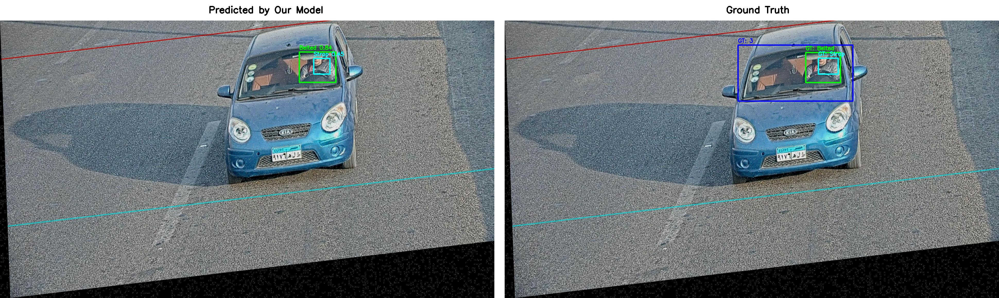
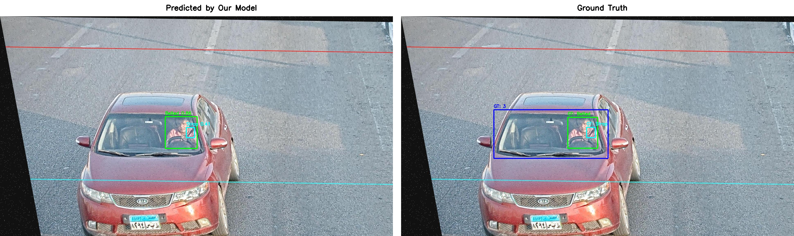
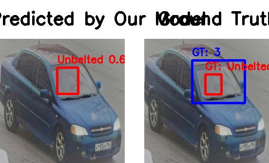
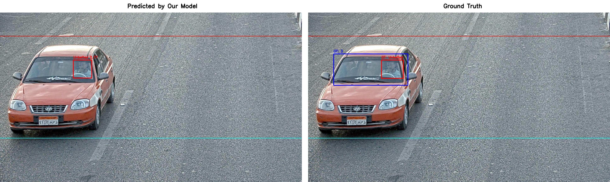

# Traffic Camera Seatbelt Compliance System

**Live Demo / Website:** [https://nammabtp.vercel.app](https://nammabtp.vercel.app)

A cascaded, high-precision deep learning pipeline built with YOLOv8 to automatically detect seatbelt usage in high-resolution traffic camera feeds.

## Dataset

The raw traffic camera image dataset utilized for training and evaluation in this project can be found on Roboflow:
[Seatbelt Detection Dataset](https://universe.roboflow.com/traffic-violations/seatbelt-detection-esut6)

---

## Architecture

This system uses a three-stage pipeline to handle variations in car models, camera angles, and small object detection (thin seatbelts):
1. **Stage 3 (Windshield Detection):** Localizes and extracts the windshield Region of Interest (ROI) from the full traffic camera frame.
2. **Stage 4 (Occupancy Classification):** Filters out empty seats with a lightweight classifier trained on whole-crop regions.
3. **Stage 5 (Seatbelt Detection):** Performs binary compliance detection (`person-seatbelt` vs `person-noseatbelt`) on occupant-bearing crops.

### Advanced Features
- **Dynamic CLAHE Fallback:** If Stage 5 detects an occupant but is uncertain about their belt state (confidence < `0.25`), the system applies Contrast Limited Adaptive Histogram Equalization (CLAHE) to the crop to reveal hidden straps in challenging lighting.
- **Asymmetric Class Balancing:** The natural class imbalance of empty vs occupied seats was mitigated via targeted augmented oversampling (horizontal flip, contrast jitter) without polluting validation sets.

---

## Performance Metrics

The system was rigorously evaluated on a held-out Test Set to measure true generalization. 

### Isolated Stage Metrics (Test Set)
- **Stage 3 (Windshield Detection):** Precision 98.5% | Recall 98.6% | mAP@50 0.993
- **Stage 4 (Occupancy Classification):**
  - `with_occupant`: Precision 98.7% | Recall 99.7%
  - `without_occupant`: Precision 98.4% | Recall 92.4%
- **Stage 5 (Seatbelt Detection):**
  - Unweighted Mean Compliance AP (mAP@50): 0.984
  - Compliant Occupant (`person-seatbelt`) AP: 0.987
  - Non-Compliant Occupant (`person-noseatbelt`) AP: 0.981

### End-to-End Cascaded Performance
To calculate the honest, system-level deployment metric, the full pipeline (including CLAHE fallback) was run end-to-end on raw Test Set images containing occupants. The core deployment goal is **Violation Detection**.

- **End-to-End Precision:** 95.53%
- **End-to-End Accuracy:** 86.99%
- **Test Set mAP@50 (Compliance):** 0.984

*Conclusion: The phenomenal 95.5% precision means that if the pipeline flags a seatbelt violation, it is almost certainly genuine—an ideal trade-off for automated ticketing systems.*

---

## Example Outputs
*Below are purely model predictions (no ground truth) generated dynamically on unseen test data.*

### Belted Occupants (Compliant)



### Unbelted Occupants (Violations)



---

## Installation & Setup

1. **Clone the repository:**
```bash
git clone https://github.com/ArpitSinhaDTU/prediction.git
cd prediction
```

2. **Install dependencies:**
Ensure you have Python 3.8+ installed, then run:
```bash
pip install ultralytics opencv-python numpy
```

3. **Download the pre-trained weights:**
Due to GitHub file size limits, the heavy YOLOv8 weights are stored externally. Download them from the Google Drive links below and place them in the correct directories (create the directories if they do not exist):

- **Stage 3 (Windshield):** [Download Here](https://drive.google.com/file/d/1SqYD0KUKPhL6-NGc59iACbT_G2c7wZiy/view?usp=sharing) 
  ➔ Place in: `outputs/stage3_run5/weights/best.pt`

- **Stage 4 (Occupant):** [Download Here](https://drive.google.com/file/d/1Q7ybp2gMTEnT_mCvueSkmZhVxNWTE_vl/view?usp=sharing)
  ➔ Place in: `outputs/stage4/weights/best.pt`

- **Stage 5 (Seatbelt):** [Download Here](https://drive.google.com/file/d/1RryHaS297xlPpjJD9lX5sgf4KgZaP7Z-/view?usp=sharing)
  ➔ Place in: `outputs/cropped_det_dataset/outputs/stage52/weights/best.pt`

---

## Usage

To evaluate images through the end-to-end cascaded pipeline, use the provided evaluation script:

```bash
python scripts/evaluate_pipeline.py
```

*Note: You will need to modify the `test_images_dir` variable inside `scripts/evaluate_pipeline.py` to point to your local directory of raw traffic camera images before running.*

# APGCC-aims: Enhanced Point-based Crowd Counting and Localization

This repository extends the official [APGCC](https://github.com/AaronCIH/APGCC) (Improving Point-based Crowd Counting and Localization Based on Auxiliary Point Guidance - ECCV 2024) implementation by adding robust **video inference**, **frame extraction**, and **HUD dashboard visualization** capabilities for real-world crowd analysis.

[Project Page](https://apgcc.github.io/) | [Paper](https://arxiv.org/abs/2405.10589) | [Original Code](https://github.com/AaronCIH/APGCC)

## ✨ Custom Features in APGCC-aims
- **Temporal Persistent Point Tracking**: Tracks crowd instances across video frames.
- **HUD Dashboards**: Overlays real-time crowd count, alerts, and safety warning levels.
- **Automated Reporting**: Generates statistics (min/max/average count) and alert event logs (`tracked_analysis_report.txt`).
- **Data Visualization**: Outputs crowd count line graphs over time (`tracked_crowd_count_plot.png`).
- **Flexible Frame Extraction**: Extract and analyze specific video frames using frame indices or timestamps.

## Introduction (From Original Paper)
Crowd counting and localization have become increasingly important in computer vision. We propose Auxiliary Point Guidance (APG) to provide clear and effective guidance for proposal selection and optimization, addressing the core issue of matching uncertainty. Additionally, we develop Implicit Feature Interpolation (IFI) to enable adaptive feature extraction in diverse crowd scenarios, further enhancing the model's robustness and accuracy.


## Setup & Installation

1) Create a conda environment and activate it.
```bash
conda create --name apgcc python=3.8 -y
conda activate apgcc
```

2) Install dependencies.
```bash
pip install -r requirements.txt
```

3) Download Pretrained Weights.
Pretrained SHHA weights must be placed in `./apgcc/output/`. You can download them using `curl`:
```bash
mkdir -p apgcc/output
curl -L "https://docs.google.com/uc?export=download&id=1pEvn5RrvmDqVJUDZ4c9-rCJcl2I7bRhu" -o ./apgcc/output/SHHA_best.pth
```

## How to Run Inference

All results will be saved in the directory specified by `--output_dir` (default is `./inference_results/`).

### 1. Unified Video & Specific Frame Analysis (Recommended)
This tool performs temporal persistent point tracking, generates crowd counting plots, compiles text reports, and optionally extracts arbitrary frames for density analysis.

**Option A: Full video analysis and extract specific frames** (e.g., frames 50, 150, 250, 350)
```bash
python apgcc/analyze_video_and_frames.py \
  --video stock-footage-mumbai-maharashtra-india-mumbai-stampede-mumbai-ganesha-festival.webm \
  --weights apgcc/output/SHHA_best.pth \
  --config apgcc/configs/SHHA_test.yml \
  --output_video mumbai_tracked_output.mp4 \
  --output_dir ./inference_results \
  --frames 50,150,250,350
```

**Option B: Extract and count crowd on specific frames only** (skipping the full video process)
```bash
python apgcc/analyze_video_and_frames.py \
  --video stock-footage-mumbai-maharashtra-india-mumbai-stampede-mumbai-ganesha-festival.webm \
  --weights apgcc/output/SHHA_best.pth \
  --config apgcc/configs/SHHA_test.yml \
  --frames 100,200,300 \
  --skip_video
```

**Option C: Extract frames by timestamp** (in seconds, e.g. at 2.5s and 10.0s)
```bash
python apgcc/analyze_video_and_frames.py \
  --video stock-footage-mumbai-maharashtra-india-mumbai-stampede-mumbai-ganesha-festival.webm \
  --weights apgcc/output/SHHA_best.pth \
  --config apgcc/configs/SHHA_test.yml \
  --seconds 2.5,10.0 \
  --skip_video
```

### 2. Single Image Inference
To analyze a standalone image and output an annotated image with a HUD dashboard:
```bash
python apgcc/analyze_image.py \
  --image stampede.jpg \
  --weights apgcc/output/SHHA_best.pth \
  --config apgcc/configs/SHHA_test.yml \
  --output ./inference_results/stampede_output.jpg
```

### 3. Video Analysis (Legacy Tracking Script)
To run the basic point tracker on video frame-by-frame without the unified frame extraction capabilities:
```bash
python apgcc/analyze_video_tracked.py \
  --video stock-footage-mumbai-maharashtra-india-mumbai-stampede-mumbai-ganesha-festival.webm \
  --weights apgcc/output/SHHA_best.pth \
  --config apgcc/configs/SHHA_test.yml \
  --output_video tracked_output.mp4 \
  --output_dir ./inference_results
```

## Outputs & Reports
After running inference, you can find the following files in your output directory:
- `tracked_analysis_report.txt`: Summary of statistics (min/max/average count) and alert events.
- `tracked_crowd_count_plot.png`: Line graph of crowd count over time overlaid with safety warning levels.
- `[video_name]_output.mp4`: Processed video with points annotated in track-based colors and real-time HUD overlays.
- `frame_[index]_annotated.png`: Annotated screenshots of requested individual frame extracts.

# Number Plate Detection

This project implements an Automatic Number Plate Recognition (ANPR) pipeline using YOLOv8 for object detection and EasyOCR for text extraction. It is capable of detecting vehicles, identifying their license plates, and reading the characters on the plates.

## Features

- **Vehicle Detection**: Utilizes a pre-trained YOLOv8 model to detect vehicles in the frame.
- **License Plate Detection**: Uses a custom-trained YOLOv8 model to accurately locate license plates on the detected vehicles.
- **Vehicle Tracking**: Implements the SORT (Simple Online and Realtime Tracking) algorithm to track vehicles across video frames.
- **Optical Character Recognition (OCR)**: Integrates EasyOCR to read the text from cropped license plates. The pipeline uses multiple preprocessing techniques (grayscale, thresholding, resizing) to enhance OCR accuracy.
- **Annotated Output**: Generates visually annotated images/frames with bounding boxes and recognized text.
- **Data Export**: Saves detection results, including bounding boxes and OCR text, to a CSV file (`test.csv`).

## Project Structure

- `automatic-number-plate-recognition-python-yolov8/`: The core codebase containing the detection scripts (`main.py` for video, `main_image.py` for single images), tracking modules, and model weights.
- `sample.jpg`, `image.png`: Sample input images provided for testing the pipeline.
- `sample_annotated.jpg`: An example of the output generated by the pipeline, showing drawn bounding boxes and the detected license plate text.
- `test.csv`: The output data file containing detailed results of the detections.
- `stopped_vehicles.json`: JSON output related to specific vehicle behaviors (e.g., stopped vehicles).

## Prerequisites and Installation

The project requires Python and several dependencies, primarily:
- `ultralytics` (for YOLOv8)
- `opencv-python` (cv2)
- `numpy`
- `easyocr` (used within the utility functions)
- `sort` (included in the subfolder)

Navigate into the main project folder to install dependencies (if a `requirements.txt` is present):
```bash
cd automatic-number-plate-recognition-python-yolov8
pip install -r requirements.txt
```

## Usage

To run the number plate detection on a single image, use the `main_image.py` script:

```bash
cd automatic-number-plate-recognition-python-yolov8
python main_image.py ..\sample.jpg
```

This will:
1. Detect vehicles and license plates in `sample.jpg`.
2. Extract text from the license plates.
3. Save an annotated version of the image as `sample_annotated.jpg` in the root directory.
4. Output the detailed detection metrics to `test.csv`.

To process a video, you can similarly use the `main.py` script (refer to the inner repository's README for specific arguments and details).

# Low-Light Enhancement & Object Detection Pipeline

This repository provides an end-to-end pipeline for enhancing low-light and nighttime videos/images and performing robust object detection.

## Features
- **Video/Image Enhancement (NAFNet)**: Denoising and deblurring of low-light footage.
- **Night-to-Day Conversion (GSAD)**: Enhances illumination to convert nighttime scenes to daylight-like visibility.
- **Super Resolution (DAT)**: 4x upscaling for improved visual quality and detection accuracy.
- **Robust Object Detection**: 
  - Standard vehicles (Bus, Bike, Car, Pedestrian, Truck) using **YOLOv9**.
  - Zero-shot detection for "Auto Rickshaws" using **OWL-ViT** (Transformers).

## Directory Structure
- `AIC2024-TRACK4-TEAM15/`: Contains the core models and our custom processing scripts.
  - `process_video.py`: Enhances input videos frame-by-frame using NAFNet.
  - `detect_video.py`: Runs the object detection pipeline (YOLOv9 + OWL-ViT) on enhanced videos.
  - `run_full_pipeline.py`: Executes the complete sequence (NAFNet -> GSAD -> DAT) on single images, outputting visualizations for each stage.
- `datasets/` & `sample_dataset/`: Directories for input data and model outputs.
- `pretrained_weights/`: Model checkpoints (YOLOv9, NAFNet, GSAD, DAT).

## Usage

### 1. Enhance Video
To process and enhance a raw video, run the NAFNet enhancement script. Update the input/output paths in `process_video.py` as needed:
```bash
python AIC2024-TRACK4-TEAM15/process_video.py
```

### 2. Object Detection on Video
Once the video is enhanced, run the detection script to generate bounding boxes for standard vehicles and auto rickshaws:
```bash
python AIC2024-TRACK4-TEAM15/detect_video.py
```

### 3. Full Image Pipeline (Enhancement + Super Resolution)
To test the complete enhancement pipeline on a single image, run:
```bash
python AIC2024-TRACK4-TEAM15/run_full_pipeline.py
```
This will generate outputs for each step (`1_original_input.png`, `2_nafnet_enhanced.png`, `3_gsad_daylight.png`, `4_dat_super_resolution.png`) in the `pipeline_step_outputs/` directory.

## Requirements
- Python 3.8+
- PyTorch & CUDA (for GPU acceleration)
- `opencv-python`, `numpy`, `imageio[ffmpeg]`, `tqdm`, `Pillow`
- `transformers` (for OWL-ViT)
- `yolov9`

# Helmet Violation Detection

This directory contains a pipeline for detecting helmet violations for motorcycle riders using YOLO. 

## Features
- **Data Conversion**: `convert_to_yolo.py` converts annotations to the YOLO format.
- **Model Training**: `train_polo.py` handles the training of a custom YOLO model on the helmet dataset (`data.yaml`).
- **Video Prediction**: `video_predict.py` runs inference on traffic videos to identify riders without helmets.
- **Label Visualization**: `label_visualizer.py` helps verify annotations visually before training.
- **Evaluation**: The `report/` and `results/` folders store the evaluation curves (F1, PR) and output detections.

---

# Accident Detector

`accident_detector.py` is a specialized Python script that detects vehicle collisions and severe impacts from traffic feeds.

## Features
- **Tracking & Heuristics**: Computes Intersection over Union (IoU) of vehicle bounding boxes, alongside sudden deceleration to heuristically flag major crashes.
- **Single-Vehicle Impact**: Detects single-vehicle collisions (e.g. hitting barriers) by observing extreme speed drops near zero.
- **Neural Classifier**: Integrates an optional PyTorch ResNet-18 binary classifier to analyze cropped frames and validate whether an accident occurred with high confidence.

---

# Traffic Light Violation Detection

The `traffic-light.ipynb` notebook implements an end-to-end system for identifying vehicles running red lights.

## Features
- **Object Tracking**: Uses Supervision's `ByteTrack` to track vehicles persistently across frames.
- **Dual-ROI Logic**: Defines a waiting zone (ROI-A) and a violation zone (ROI-B) around the stop line.
- **Traffic Light State**: Uses YOLOv8 to detect traffic lights and HSV thresholding to classify the light color (Red, Green, Yellow).
- **Violation Logging**: Triggers a violation if a vehicle moves from the waiting zone to the violation zone while the light is red.
- **License Plate OCR**: Automatically crops the license plate and runs `EasyOCR` to read the violator's plate number.

---

# Speed Detector

The `speed_detector.ipynb` notebook demonstrates the fine-tuning of a YOLOv8 network for vehicle speed detection.

## Features
- **Transfer Learning**: Starts from pretrained `yolov8n.pt` weights and freezes the backbone to retain generic feature extraction.
- **Custom Architecture**: Uses a custom YAML model definition (`custom_yolo_vehicle.yaml`).
- **Training Pipeline**: Runs training using Ultralytics API with mixed precision, optimized learning rates, and automated logging to `runs/detect/`.